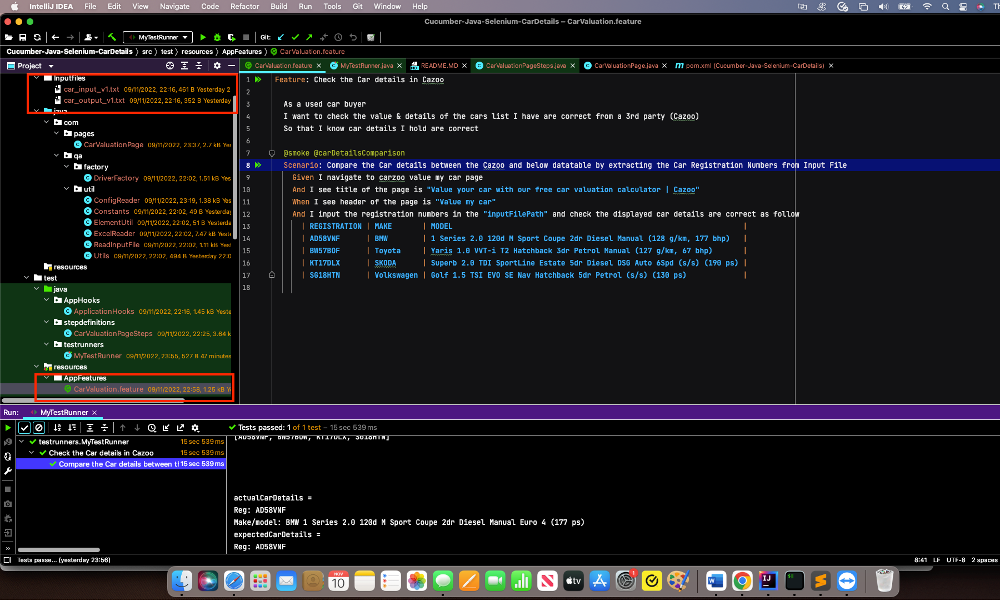

# Car Valuation - Car Details Check - BDD-Cucumber/Selenium based Test Automation Framework

## Notes:

1. The task was given to develop a test automation framework using Selenium, Java & Cucumber
2. The Output file - "car_output_v1.txt" is not as such as an OUTPUT FILE with result output details but this "car_output_v1.txt" is file with EXPECTED RESULTS to be compared against what is displayed in the Cazoo website when input and searched with a Car registration number to verify if the details shown in the Cazoo matches the pertaining details in the 'car_output_v1.txt' for the given registration number
3. Because of the reason outlined in above Point No.2 and based on the request to come up with IMPROVEMENTS, the content in the "car_output_v1.txt" file i.e., EXPECTED RESULTS are copied as they are on to the Feature File (Cucumber Data table). It is logical to have the expected results in the feature files, else the very purpose of the BDD Cucumber is not achieved.
4. There are many reasons to use a data table when testing:
    a). Data Tables in Cucumber are quite interesting and can be used in many ways. DataTables are also used to handle large amounts of data.
    b). Data tables make it easier to see how the data is structured for each cell in the form of expected results, giving a clear visibility of what is expected outcome of a given test
    c). Data tables significantly reduce repetition by storing the data that will be used repeatedly in only one place.
5. This test automation framework is developed using as minimal code as possible and can be honed further to make it robust
6. Add as many input files to - src/main/Inputfiles and add an entry in the src/test/resources/config/config.properties to further use this framework to test some more files with other registration numbers
7. Reporting, Logging framework and other bells & whistles are not added to due to time constraints

## IMPORTANT
1. Tests will fail due to assertions as the 1st Registration number's details itself are not matching between Cazoo website and outputfile
2. To see the full flow of how the automation code is picking up the registration numbers from the "car_input_v1.txt", Comment the Assertions in the - StepDefinition File - src/test/java/stepdefinitions/CarValuationPageSteps.java or use TRY CATCH Block 

## TechStack used to develop this framework
1. Java - as a coding language
2. IntelliJ - IDE
3. Selenium WebDriver - Test Automation Tool
4. Cucumber BDD - Behavior-driven development leveraging GHERKIN Syntax
5. Cucumber Datatables
6. POM - Page Object Model
7. OS - MacOS

## Test Flow - Test Case
1. Test Automation Code will automatically read the provided input file: car_input_v1.txt
2. Extract car registration numbers from the free text based on pattern(s).
3. Each car registration number extracted from input file(car_input_v1.txt) is fed to https://www.cazoo.co.uk/value-my-car/
   (Perform Free Car Check)
4. Compare the output returned by https://www.cazoo.co.uk/value-my-car/ with the provided
   car_output_v1.txt(which is added as Data table in Cucucmber Feature File - src/test/resources/AppFeatures/CarValuation.feature)
5. Highlight/fail the test for any mismatches.

## Test Automation Framework Folder Structure

This framework predominantly is structured in to 2 following core folders:

1. src/main
2. src/test

Other Files and Folders of Significance:

1. Feature File - src/test/resources/AppFeatures/CarValuation.feature
2. StepDefinition File - src/test/java/stepdefinitions/CarValuationPageSteps.java
3. Inputfiles - src/main/Inputfiles
4. Config File (to add additional inputfile references) - src/test/resources/config/config.properties
5. Utilities - src/main/java/com/qa/util
6. Pages - src/main/java/com/pages/CarValuationPage.java
7. Test Runner - src/test/java/testrunners/MyTestRunner.java
8. Hooks - src/test/java/AppHooks/ApplicationHooks.java

## How to run the tests

**Pre-requisites:**
1. Make sure you have the following plugins in your IDE(IntelliJ for example)
   1. Cucumber for JAVA
   2. Gherkin

Navigate to either of the below files ==> Right Click and select "Run"

1. Feature File - src/test/resources/AppFeatures/CarValuation.feature
2. Test Runner - src/test/java/testrunners/MyTestRunner.java

You can of course run from the iterm/terminal/command line using mvn commands - its maven - so play around

